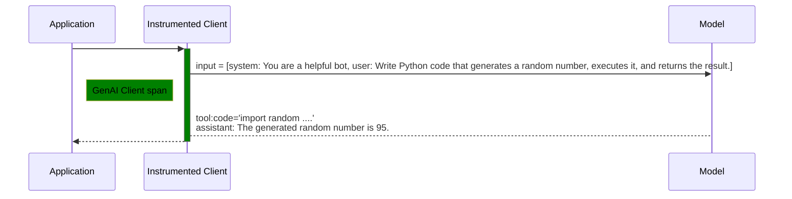

# Semantic convention Responses API
Semantic convention for built-in tools
This document covers how built in tools should be represented in Gen AI Semantic convention.

LLM call examples show how LLM calls are represented. It was discussed how tool calls are represented but those are related to client side function tool calls. This doc extends tool calls representation for built-in tools like code_interpreter from OpenAI which run on the server side.

## Response API
Responses API provides capability to use built-in tools in addition to user defined tools. Built-in tools run on a server side rather than client side. LLM makes a decision to call a tool based on requirement or configuration whether a built-in tool or client side user defined tool. At a bigger picture they work very similarly where LLM decides and calls a tool.

Following **principles** have been considered in coming up with this proposal:
- Built-in or user defined tool calls representation should be consistent.
- Tool Calls if traced on the server side for built-in tools should be represented similarly as user defined client side tools (both span and messages).
- Output of one tool can be different from another and if needed be represented differently but consistently across its representation as message vs in context of tool call span.
- Common properties should be consistently represented across tool call representation whether they are represented as spans or messages. Some of the common properties are:
    -[Existing] Tool call Id
    -[Existing] Tool Name/Tool Identifier
    -[Existing] Tool Call Arguments
    -[New] Tool Call Status

### Responses API built-in tools

```py
response = client.responses.create(  
  model="gpt-4",
  input="Write Python code that generates a random number, executes it, and returns the result.",
  tools=[{"type": "code_interpreter"}],
  include=['code_interpreter_call.outputs'],
  tool_choice="required",
)
```

**GenAI client span:**

|   Property                      |                     Value                   |
|-------------------------------- | --------------------------------------------|
| Span name                       | `"chat gpt-4"`                              |
| `gen_ai.provider.name`          | `"openai"`                                  |
| `gen_ai.operation.name`         | `"chat"`                                    |
| `gen_ai.request.model`          | `"gpt-4"`                                   |
| `gen_ai.request.max_tokens`     | `200`                                       |
| `gen_ai.request.top_p`          | `1.0`                                       |
| `gen_ai.response.id`            | `"chatcmpl-9J3uIL87gldCFtiIbyaOvTeYBRA3l"`  |
| `gen_ai.response.model`         | `"gpt-4-0613"`                              |
| `gen_ai.usage.output_tokens`    | `44`                                        |
| `gen_ai.usage.input_tokens`     | `385`                                       |
| `gen_ai.response.finish_reasons`| `["stop"]`                                  |
| `gen_ai.input.messages`         | [`gen_ai.input.messages`](#gen-ai-input-messages-built-in-tools) |
| `gen_ai.output.messages`        | [`gen_ai.output.messages`](#gen-ai-output-messages-built-in-tools) |

<span id="gen-ai-input-messages-built-in-tools">`gen_ai.input.messages` value</span>

```json
[
  {
    "role": "system",
    "parts": [
      {
        "type": "text",
        "content": "You are a helpful bot"
      }
    ]
  },
  {
    "role": "user",
    "parts": [
      {
        "type": "text",
        "content": "Write Python code that generates a random number, executes it, and returns the result."
      }
    ]
  }
]
```

<span id="gen-ai-output-messages-built-in-tools">`gen_ai.output.messages` value</span>

```json
[
  {
    "role": "assistant",
    "parts": [
      {
        "type": "tool_call",
        "id": "call_VSPygqKTWdrhaFErNvMV18Yl",
        "name": "code_interpreter",
        "arguments": {
          "code": "import random\n\n# Generate a random number\nrandom_number = random.randint(1, 100)\n\n# Execute some operation with the random number (e.g., squaring it)\nresult = random_number ** 2\n\nrandom_number, result",
        "container_id": "cntr_690bdbfed8688190884efd4c7ae6435b0db1f006442e8941",
        }
      },
      {
        "type": "tool_call_response",
        "id": " call_VSPygqKTWdrhaFErNvMV18Yl",
        "response": [
            {
              "logs": "(10, 20)",
              "type": "logs"
            }
        ],
      },
      {
        "type": "text",
        "content": "The generated random number is **89**, and the result of squaring it is **7921**"
      }
    ],
    "finish_reason": "stop"
  } 
]
```

**Server Tool call:**

If tool call is [instrumented according to execute-tool span definition](/docs/gen-ai/gen-ai-spans.md#execute-tool-span) on server side, it may look like

|   Property                      |                     Value                   |
|---------------------------------|---------------------------------------------|
| Span name                       | `"execute_tool code_interpreter"`                |
| `gen_ai.tool.call.id`           | `"call_VSPygqKTWdrhaFErNvMV18Yl"`           |
| `gen_ai.tool.name`              | `"code_interpreter"`                             |
| `gen_ai.operation.name`         | `"execute_tool"`                            |
| `gen_ai.tool.type`              | `"built-in"`                                |
| `gen_ai.tool.call.arguments`    | <pre><code>{<br>  "code": "import random\\n\\n# Generate a random number\\nrandom_number = random.randint(1, 100)\\n\\n# Execute some operation with the random number (e.g., squaring it)\\nresult = random_number ** 2\\n\\nrandom_number, result",<br>  "container_id": "cntr_690bdbfed8688190884efd4c7ae6435b0db1f006442e8941"<br>}</code></pre> |
| `gen_ai.tool.result`             | <pre><code>[<br>  {<br>    "logs": "(10, 20)",<br>    "type": "logs"<br>  }<br>]</code></pre> |

> [!NOTE]
>
> Tool Call Response being well defined for known tools like `code_interpreter` etc is out of scope. 

#### Tool Call Response as Polymorphic property (Out of scope)
Different providers have different tools and each tool can have it own specific response. Having one defined structure for tools can be helpful but at the same time be limiting if a tool response cannot be defined by a generic response structure. Proposal is to allow different tools/tool provider to define tool specific tool response structue. Making Tool Response property being polymorphic.

### Open Questions
- If server tracing is available, should that also generate span which show assistant was called with a user message and assistant called a tool ? 